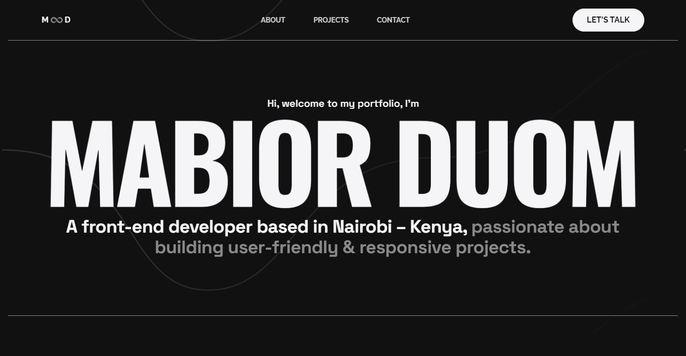

<h1 align="center">mabior - v2</h1>

<p align="center">Second iteration of my personal portfolio built with React and hosted on Netlify</p>

<div align="center">
  
  
  [](https://twitter.com/intent/follow?screen_name=mabiorduom)
  
  

  <a href="https://mabior.netlify.app/"><strong>➥ Live Demo</strong></a>

</div>



 
##  🚨 Prerequisite
Download [Node.js](https://nodejs.org/en/download/).

Also, before you clone this repository, I kindly ask you to respect the intellectual property rights and give credit where credit is due. I’ve put hard work and effort into creating and maintaining this code and would greatly appreciate if you include a link to the original repository and my name in any derivative work or documentation as a form of proper attribution. 

## 🛠 Installation and Setup 

Run the following commands:

``` bash
# Create react-app using vite:
npm create vite@latest [project-name] --template react

# or Clone the repo
git clone https://github.com/mde3/mabior-v2.git

# Install packages and dependencies
npm i or npm install

#  Run development server
npm run dev

# Build for production in the dist directory
npm run build
```

## License
Distributed under the MIT License - see [LICENSE](LICENSE) file for details.
